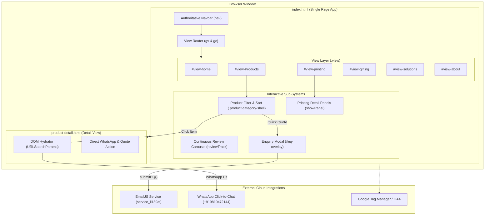
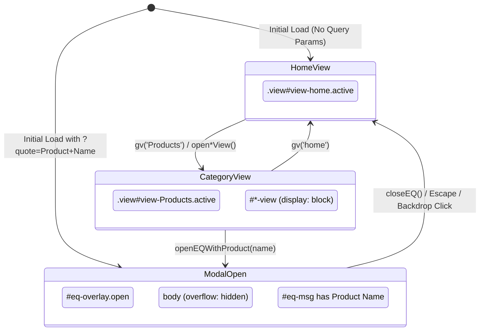

# Printing Point — Technical Architecture

> **Document Purpose**: Complete architectural specification for the **Printing Point** web application, documenting its client-side state model, component hierarchy, routing mechanics, integrations, and lifecycle execution.

---

## 1. Architectural Overview

The Printing Point web platform is structured as a **hybrid client-side Single Page Application (SPA) with a dedicated dynamic detail page template**.



---

## 2. Component & DOM Hierarchy

### 2.1 Authoritative Navigation (`<nav class="nav">`)
- **Logo**: `.nav-logo` with gold brand highlight, triggers `gv('home')`.
- **Top-Level Links**:
  - `Corporate Gifting`: Dropdown links triggering `gv('gifting')` and sub-targets.
  - `Products`: Dropdown items invoking category-specific functions (`openBottlesView()`, `openMugsSippersView()`, etc.).
  - `Printing Services`: Dropdown items triggering `gv('printing')` and panel navigations.
  - `Solutions`: Dropdown items invoking `gv('solutions')`.
  - `About`: Invokes `gv('about')`.
  - `Contact`: Invokes `openEQ()`.

### 2.2 Top-Level Views (`.view`)
All views reside in `index.html`. Only one view is active at any given moment, controlled by CSS class `.active`:
- **`#view-home`**: Cover hero, client logo grid, stats bar, table of contents, featured collections, why choose us, client reviews marquee, and footer.
- **`#view-Products`**: Corporate product categories grid (`#corporate-categories`) and dedicated sub-views:
  - `#bottles-view`
  - `#mugs-sippers-view`
  - `#bags-view`
  - `#gift-sets-view`
  - `#notebooks-view`
  - `#electronics-view`
  - `#mobile-stands-view`
  - `#kitchen-view`
- **`#view-printing`**: Main services grid (`#printing-main-grid`) and 7 sub-panels:
  - `#vc-panel` (Visiting Cards)
  - `#lb-panel` (Letterheads & Bill Books)
  - `#env-panel` (Envelopes)
  - `#id-panel` (ID Cards & Lanyards)
  - `#df-panel` (Marketing Collateral)
  - `#sl-panel` (Signage & Large Format)
  - `#gt-panel` (Packaging & Rigid Boxes)
- **`#view-gifting`**: Dedicated corporate gifting solutions, welcome kit builder overview, and festive catalogues.
- **`#view-solutions`**: Turnkey corporate solutions (Employee Onboarding, Events, Brand Launches, Office Branding).
- **`#view-about`**: Infrastructure, machinery overview (Heidelberg offset, Konica Minolta digital, Roland wide format, laser engraving suites), client roster, and quality assurance.

### 2.3 Enquiry Modal (`#eq-overlay`)
- Fullscreen fixed overlay with backdrop blur.
- Contains form `#eq-form-wrap`:
  - Input: `Full Name` (`#eq-name`)
  - Input: `Company Name` (`#eq-company`)
  - Input: `Work Email` (`#eq-email`)
  - Input: `Phone Number` (`#eq-phone`)
  - Dropdown: `Product Interest` (`#eq-product`)
  - Input: `Estimated Quantity` (`#eq-qty`)
  - Dropdown: `Branding Method` (`#eq-branding`)
  - Textarea: `Additional Specifications` (`#eq-msg`)
  - Submit Button: `#eq-submit-btn`

---

## 3. State Management & Event Mechanics



### 3.1 Routing Functions (`js/main.js`)
- `gv(viewName, subSection)`:
  - Clears `.active` from all `.view` elements.
  - Adds `.active` to `#view-${viewName}`.
  - Updates navigation link highlight (`.nbtn.active`).
  - Smoothly resets scroll to top (`window.scrollTo(0, 0)`).
- `showView(viewId)` / `closeAllViews()`:
  - Toggles between the high-level category grid (`#corporate-categories`) and individual category sub-views.
  - Smoothly scrolls to category anchor `#cs-corporate`.
- `showPanel(panelId)` / `showMain()`:
  - Toggles between printing grid `#printing-main-grid` and detailed spec panels (`#*-panel`).

### 3.2 Dynamic Search & Alphabetical Sorting
Each `.product-category-shell` runs an independent client-side filter engine:
- **Search Listener**: `search.addEventListener('input', render)` performs case-insensitive substring matching against `.prodcard-name`.
- **Sort Listener**: `sort.addEventListener('change', render)` supports:
  - `az`: Alphabetical ascending sort.
  - `za`: Alphabetical descending sort.
  - Default: Preserves original DOM indexing order.
- **Counter & Empty State**: Updates `.pct-count` text and toggles display of `.pct-empty`.

### 3.3 Seamless Review Marquee
- The `#reviewTrack` container uses CSS `@keyframes scrollReviews`.
- In `js/main.js`, `DOMContentLoaded` clones all original review card nodes once with `aria-hidden="true"`, ensuring continuous loop without any visual flicker or blank reset.

---

## 4. Cross-Page Communication & URL Protocol

Communication between `index.html` and `product-detail.html` is stateless, executed purely through URL query parameters:

| Source | Destination | Parameter | Description |
|---|---|---|---|
| Product Card | `product-detail.html` | `name` | Human-readable product name |
| Product Card | `product-detail.html` | `category` | Product category taxonomy |
| Product Card | `product-detail.html` | `img` | Relative or external path to product image |
| Product Detail CTA | `index.html` | `quote` | Product name to pre-fill in the enquiry modal |
| Product Detail CTA | `https://wa.me/...` | `text` | Encoded WhatsApp introductory quote query |

When `index.html` loads with `?quote=...`:
1. `URLSearchParams` extracts the value.
2. `openEQWithProduct(quoteProduct)` pre-fills the `#eq-msg` field and displays the modal.
3. `window.history.replaceState({}, document.title, window.location.pathname)` immediately cleans the URL without reloading, preventing subsequent unwanted modal triggers on browser refresh.

---

## 5. Third-Party Integrations

### 5.1 EmailJS Form Dispatch
- **SDK**: Loaded via CDN `@emailjs/browser@4`.
- **Public Key**: `iWvcXhFH9YZ1vbcqC`
- **Service ID**: `service_ll189at`
- **Template ID**: `template_nzv0vxj`
- **Payload Schema**:
  ```json
  {
    "name": "Full Name",
    "company": "Company Name",
    "email": "user@workemail.com",
    "phone": "+91 98123 45678",
    "product": "Corporate Bottles / Selected Category",
    "qty": "500",
    "branding": "Laser Engraving / UV Print / Screen Print",
    "message": "Custom requirements and notes"
  }
  ```

### 5.2 WhatsApp Click-to-Chat
- Formatted endpoint: `https://wa.me/919810472144?text=<encoded-message>`
- Used on the product detail page and in the floating WhatsApp badge (`.float-wa`).

### 5.3 Google Tag Manager & Google Analytics 4
- Container ID: `AW-17996948973`
- Measurement ID: `G-4CFGYBLJ67`
- Initialized asynchronously in `<head>`.
