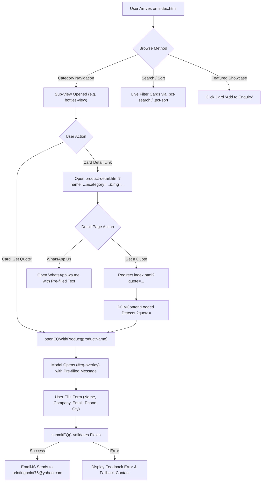

# Printing Point — Project Context for AI Agents & Developers

> **Document Purpose**: This file provides comprehensive context for AI agents, language models, and developers working on the **Printing Point** codebase. It outlines the business domain, architecture, data taxonomy, user journeys, conventions, integration secrets/keys, and extension guidelines.

---

## 1. Executive Summary & Brand Profile

- **Brand Name**: Printing Point (styling: *Printing* **Point**)
- **Headquarters**: Delhi / NCR, India
- **Industry**: Corporate Gifting, Promotional Merchandise, Commercial & Industrial Printing
- **Target Audience**: B2B Corporate Procurement Teams, HR Managers (Onboarding / Welcome Kits), Event Planners, Marketing & Brand Directors, Educational & Healthcare Institutions.
- **Value Proposition**: Premium quality, bespoke branding capabilities, scalable bulk order fulfilment (50 to 50,000+ units), competitive tier pricing, and rapid quote turnaround.
- **Direct Contacts**:
  - **Phone / WhatsApp**: `+91 98104 72144`
  - **Official Email**: `printingpoint76@yahoo.com`
- **Key Client Portfolio (Featured on Site)**:
  - *Hospitality & Real Estate*: The Ashok, Shapoorji Pallonji Engineering & Construction, Sirca Wood Coatings (Italy)
  - *Healthcare & Science*: Sir Ganga Ram Hospital, Smpl Life Sciences Pvt. Ltd.
  - *Industrial & Energy*: JK MAXX Paints, Jamna Auto Industries, smartJoules, Balaji Industries, Oikos
  - *Defense, Sports & Logistics*: Subroto Cup International Football Tournament, Leostar Logistics, Laxna Shipping Lines, AGNi, AVR

---

## 2. Technology Stack & Architectural Constraints

The project is deliberately engineered as a **zero-dependency, high-performance static web application**:

| Layer | Technology | Rationale |
|---|---|---|
| **Markup** | HTML5 (Semantic) | Fast parsing, SEO indexable, accessible, no build pipeline |
| **Styling** | Modern CSS3 + CSS Custom Properties | Pure CSS architecture with design tokens, modular stylesheets |
| **Logic** | Vanilla ES6+ JavaScript | Zero external JS framework overhead; ultra-fast load time |
| **Fonts** | Google Fonts (`Cormorant Garamond` + `DM Sans`) | Elegant luxury editorial aesthetic paired with crisp readability |
| **Email Service** | EmailJS Browser SDK (`v4`) | Client-side form dispatch without requiring an active backend server |
| **Analytics** | Google Tag Manager / GA4 | Event tracking, ad conversions (`AW-17996948973`, `G-4CFGYBLJ67`) |
| **Communication** | WhatsApp Click-to-Chat API | Direct 1-click B2B lead generation via pre-filled messaging |

### Runtime & Hosting Requirements
- Can be served via **any static web server** (e.g. `npx serve`, `python3 -m http.server 8000`, Nginx, Cloudflare Pages, Vercel, Netlify, GitHub Pages).
- **No Node.js build step is required** during development or deployment.

---

## 3. Product Catalog Taxonomy

The product catalog is structured into two core service pillars:

### Pillar A: Corporate Gifting & Products (`#view-Products`, `#view-gifting`)
1. **Bottles & Flasks** (`bottles-view`)
   - Stainless steel vacuum-insulated flasks, matte finish flasks, hip flask gift sets, sipper bottles, smart LED temperature display bottles, glass infusers, collapsible silicone bottles, hydration reminder bottles.
2. **Mugs & Sippers** (`mugs-sippers-view`)
   - Self-stirring mugs, ceramic coffee mugs, insulated travel tumblers, bamboo fiber mugs, double-wall stainless steel sippers.
3. **Bags & Sleeves** (`bags-view`)
   - Executive laptop backpacks, slim laptop sleeves, canvas totes, anti-theft travel bags, vegan leather duffles, conference document folders.
4. **Gift Sets & Combos** (`gift-sets-view`)
   - Premium executive gift boxes, flask & pen sets, diary + powerbank + metal pen combinations, festive celebration hampers.
5. **Notebooks & Writing** (`notebooks-view`)
   - Hardbound corporate journals, PU leather notebooks with pen loop, recycled Kraft paper notebooks, metal executive rollerball and ballpoint pens.
6. **Electronics & Tech Accessories** (`electronics-view`)
   - Fast-charging power banks (10,000mAh - 20,000mAh), Bluetooth speakers, wireless charging pads, multi-port USB hubs, 3-in-1 charging cables.
7. **Mobile Stands & Everyday Carry** (`mobile-stands-view`)
   - Ergonomic aluminum phone/tablet stands, desktop organizers, pop sockets, engraved metal & leather keychains, lanyard cardholders.
8. **Home, Kitchen & Lifestyle** (`kitchen-view`)
   - Stainless steel lunch boxes, insulated food jars, cutlery travel sets, ambient desk lamps, hourglass sand timers, indoor desk planter sets.

### Pillar B: Commercial Printing Services (`#view-printing`)
Interactive panels switcher (`showPanel()`) covering:
- **Visiting Cards (`vc-panel`)**: Premium 350-450 GSM matte/gloss, velvet touch, gold/silver foil stamping, spot UV, embossed business cards.
- **Letterheads & Envelopes (`lb-panel`, `env-panel`)**: Executive corporate stationery, watermarked paper, security print.
- **ID Cards & Lanyards (`id-panel`)**: RFID / smart PVC identity cards, customized sublimation printed satin lanyards.
- **Marketing Collateral & Brochures (`df-panel`)**: Bi-fold, tri-fold brochures, flyers, catalogues, presentation folders.
- **Signage & Large Format (`sl-panel`)**: Roll-up standees, vinyl banners, acrylic 3D signage, trade show booth backdrops.
- **Gifting Boxes & Packaging (`gt-panel`)**: Custom rigid gift boxes, mono cartons, branded ribbon, custom die-cut foam inserts.

---

## 4. Key Workflows & User Journeys



### Flow 1: Global View Routing (SPA Navigation)
- Navigation bar items invoke `gv(viewName, subSection)`.
- `gv('home')` displays hero, stats, category teasers, and testimonials.
- `gv('Products')` activates the corporate products view.
- `gv('printing')` activates printing services with panel switching.
- `gv('gifting')` displays corporate gifting packages & solutions.
- `gv('solutions')` displays industry-specific solutions (onboarding, festive, events).
- `gv('about')` displays heritage, machinery, and capability details.

### Flow 2: Live Search & A-Z Sorting in Categories
- Each category container `.product-category-shell` has a search input (`.pct-search`) and a sort selector (`.pct-sort`).
- As the user types, product cards are instantly filtered in the DOM.
- The sort selector dynamically re-orders elements alphabetically (A-Z or Z-A) or returns to default.
- An empty state (`.pct-empty`) is toggled automatically when zero matches occur.

### Flow 3: Product Detail & Cross-Page State
- Detailed view lives at `product-detail.html`.
- Parameters are passed via URL query string:
  `product-detail.html?name=Glass%20Bottle&category=Bottles%20%26%20Flasks&img=assets/images/products/...`
- `js/product-detail.js` parses parameters, hydrates DOM headings, breadcrumb, and main photo.
- Clicking "Get a Quote" on the detail page returns to `index.html?quote=Glass%20Bottle`.
- `js/main.js` listens on load, reads `quote`, opens the modal pre-filled, and uses `window.history.replaceState` to strip the parameter cleanly from the URL bar.

### Flow 4: Quotation Lead Submission via EmailJS
- Form validation checks mandatory fields: `Full Name`, `Company Name`, `Work Email` (verified via regex), `Phone Number`, `Product Interest`, and `Estimated Quantity`.
- Email service uses:
  - **Service ID**: `service_ll189at`
  - **Template ID**: `template_nzv0vxj`
  - **Public Key**: `iWvcXhFH9YZ1vbcqC`
- Success state displays green indicator, clears fields, and automatically dismisses modal after 3 seconds.

---

## 5. Directory Structure & File Map

```
newpr/
├── index.html                 # Main Single Page Application HTML (clean, modular)
├── product-detail.html        # Dynamic Product Detail Template
├── css/
│   ├── tokens.css             # Authoritative Design System Tokens & reset
│   ├── style.css              # Main site stylesheet (layout, views, components, modal)
│   └── product-detail.css     # Dedicated styling for product detail template
├── js/
│   ├── main.js                # Core SPA routing, filtering, panels, enquiry & EmailJS
│   └── product-detail.js      # URL param parser, DOM hydration & CTA links
├── assets/
│   └── images/
│       ├── clients/           # 16 extracted client brand logos (PNG)
│       └── products/          # Extracted product imagery (JPG/PNG)
├── files/                     # Synchronized copy for backwards-compatibility
├── docs/                      # Mirror documentation repository
│   ├── CONTEXT.md
│   ├── ARCHITECTURE.md
│   └── DESIGN.md
├── CONTEXT.md                 # Agent context reference (this document)
├── ARCHITECTURE.md            # Technical architecture and component hierarchy
├── DESIGN.md                  # Visual identity, typography, layout & UI guidelines
└── README.md                  # Quick-start guide & repository index
```

---

## 6. Conventions & Rules for AI Agents

When modifying or extending this codebase, adhere strictly to these rules:

1. **Maintain Zero-Build Vanilla Simplicity**:
   Do not introduce bundlers (Webpack, Vite, Rollup) or external front-end frameworks (React, Vue) unless explicitly requested by the user.

2. **Design Tokens First**:
   Always use CSS variables from `css/tokens.css` (`var(--navy)`, `var(--gold)`, `var(--fb)`, etc.). Never hardcode hex colors that clash with the brand.

3. **Product Card Markup Standard**:
   When adding a new product card, follow the established DOM schema:
   ```html
   <div class="prodcard">
     
     <div class="prodcard-body">
       <div class="prodcard-name">Item Title</div>
       <button class="prodcard-btn" onclick="openEQWithProduct('Item Title')">Add to Enquiry</button>
     </div>
   </div>
   ```
   Or for cards linking to the detail view:
   ```html
   <a class="prodcard-link" href="product-detail.html?name=Item%20Title&category=Category%20Name&img=assets/images/products/item-name.jpg">
     <!-- Card contents -->
   </a>
   ```

4. **No Giant Embedded Data**:
   Never paste raw base64 data URIs into HTML files. Save new images into `assets/images/` and reference them with relative paths.

5. **Modal Accessibility & Event Cleanliness**:
   Ensure `openEQ()` locks body scroll (`overflow: hidden`) and `closeEQ()` properly restores it. Keep the Escape key listener and overlay backdrop click functional.

6. **Email & Lead Integrity**:
   The primary company recipient is `printingpoint76@yahoo.com`. Always provide this address as a clickable fallback if network issues cause EmailJS delivery failures.
